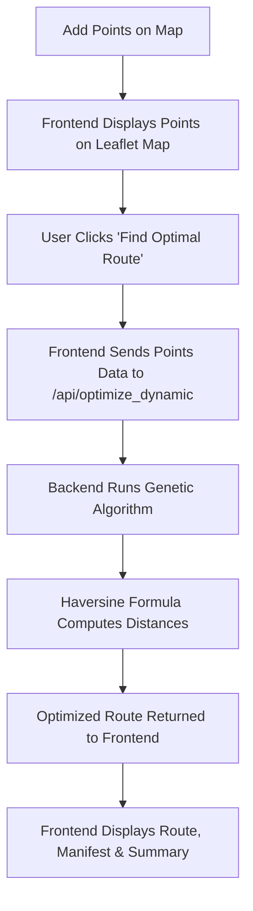

# 🚚 Transport Optimizer

## 📖 Overview
*Transport Optimizer* is a web-based application designed to solve the Vehicle Routing Problem (VRP) by finding the most efficient route for deliveries starting and ending at a central depot.  
Built with a *React frontend* and a *Flask backend, this project leverages a **Genetic Algorithm (GA)* to compute the optimal sequence of stops, minimizing the total travel distance.  
The system allows users to visualize delivery points on an *interactive map*, add or remove stops, and generate optimized routes with detailed summaries.  
By integrating real-world *geographical calculations (Haversine formula)*, this project ensures high accuracy in distance estimation and demonstrates how AI and optimization algorithms can streamline logistics and delivery operations.

## Why this project?
Efficient route planning is critical in logistics and delivery management. This project showcases how evolutionary algorithms like Genetic Algorithms can be applied to complex real-world optimization problems, helping reduce travel distance, time, and fuel costs.

## ✨ Key Features
| Feature | Description |
|---------|-------------|
| 🗺 Interactive Map | Visualize depot and delivery points dynamically using Leaflet. |
| 📍 Dynamic Point Entry | Right-click on the map to add new delivery locations. |
| 🗑 Point Management | Remove or modify added delivery points easily. |
| ⚙ Genetic Algorithm | Optimize routes using GA operations (selection, crossover, mutation). |
| 🌍 Haversine Formula | Compute accurate real-world distances between latitude/longitude points. |
| 📊 Route Visualization | Display the optimized route polyline connecting all delivery points. |
| 🧾 Route Manifest | View the optimized sequence of stops, including depot start and end. |
| 📈 Summary Statistics | Show total distance and stop count for the optimized route. |
| 🔄 Dynamic Optimization | Send user-defined points to backend for real-time route optimization. |
| 🔐 User Authentication | Basic demo login interface with hardcoded credentials. |

## 🛠 Tech Stack
| Category | Tools |
|----------|-------|
| Frontend | React, Leaflet, React Router DOM, Axios, Tailwind CSS |
| Backend | Flask, Flask-CORS |
| Algorithm | Python, NumPy, Pandas, SciPy |
| Visualization | Leaflet Map, Polyline Routing |
| Data | CSV |
| Authentication | Basic frontend auth for demonstration |

## ⚡ Workflow Diagram

## 🧬 Algorithm Steps
📥 *Input Data* – Points are collected (latitude, longitude, depot flag) either from a static CSV or user input.

🧾 *Distance Matrix* – Compute pairwise distances between all points using the Haversine formula.

🧬 *Genetic Algorithm Process*
1. *Initialization* – Generate random routes as the initial population.  
2. *Fitness Calculation* – Evaluate total distance of each route (shorter = better).  
3. *Selection* – Choose the best candidates using tournament selection.  
4. *Crossover* – Combine two parent routes via ordered crossover.  
5. *Mutation* – Randomly swap two cities with a small probability.  
6. *Iteration* – Repeat for multiple generations until the best route is found.

🏆 *Output* – Return the shortest path (optimized sequence of stops) and total travel distance.

## 📊 Example Results
| Test Case | No. of Points | Best Distance (km) | Time (s) | Algorithm Used |
|------------|---------------|--------------------|----------|----------------|
| Example 1 | 10 | 42.6 | 1.2 | Genetic Algorithm |
| Example 2 | 15 | 68.4 | 2.1 | Genetic Algorithm |
| Example 3 | 20 | 91.7 | 3.0 | Genetic Algorithm |

<pre> 
📂 Project Structure
transport-optimizer/
│── backend/
│   ├── app.py                  # Flask API endpoints
│   ├── controllers/
│   │   └── ga_solver.py        # Genetic Algorithm and Haversine calculations
│   └── utils/
│       └── data_generator.py   # Script to generate synthetic data
│── dataset/
│   └── synthetic_routes_large.csv
│── frontend/
│   ├── src/
│   │   ├── App.js              # Main React app and map logic
│   │   ├── index.js            # Entry point
│   │   ├── App.test.js         # Unit tests
│   │   ├── index.css           # Tailwind global styles
│   └── public/
│       └── index.html
│── README.md                   # Project documentation
</pre> 

## ⚡ How It Works
1. Load Initial Points → Points are loaded and displayed on the map.  
2. Add or Remove Points → Right-click to add new delivery points or delete them.  
3. Run Optimization → On clicking “Find Optimal Route”, current points are sent to backend.  
4. Backend Processing → Flask executes Genetic Algorithm and calculates total route distance.  
5. Display Results → Optimized route and metrics are shown on the map and summary cards.

## 📌 Usage
*Admin/Developer Mode*
1. Run backend:
    bash
    cd backend
    pip install Flask Flask-Cors pandas numpy scipy
    python app.py
    
2. Run frontend:
    bash
    cd frontend
    npm install
    npm start
    

*User Mode*
- Open the web app (default: http://localhost:3000).  
- Add delivery points and depot.  
- Click “Find Optimal Route” to generate the best route.  
- View total distance and route manifest.

## 🔮 Future Enhancements
- Multi-vehicle optimization (Capacitated VRP).  
- Real-time traffic integration using map APIs.  
- Configurable GA parameters via frontend UI.  
- Support for time window constraints.  
- Persistent route saving and user profiles.  
- Integration with Google Maps or OpenStreetMap APIs.  
- Enhanced UI with progress visualization and live GA animation.

## 💚 Support & Feedback

If you found this project helpful, consider giving it a ⭐ on GitHub!
For feedback or suggestions, reach out at praneethbathini2916@gmail.com

## ✍️ "Routes aren’t just about distance; they’re about decisions. Optimize wisely."
